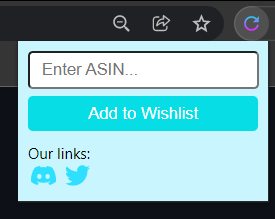

<!-- PROJECT LOGO -->
 

  

  <h3 align="center">Amazon Add to Wish List Chrome extension</h3>

<!-- ABOUT THE PROJECT -->
## About The Project

  

This Chrome Extension adds a product to your Amazon wishlist using the product's ASIN value even if the page is down.

<!-- GETTING STARTED -->
## Getting Started

### Installation

1. Click on the Code button and download the ZIP file.
2. Unzip the file.
3. Open Chrome and type in 
   `
   chrome://extensions
   `
4. Click on "Load Unpacked" and select the path of the Unzipped files.

### Find a products ASIN

1. Go to the products page.
2. Scroll down to the product's details page.
3. The ASIN of the product will be visible.

### Usage

1. Once installed select the extension. A popup will be seen.
2. Open any Amazon product page which has a Wish List button and is in stock.
3. Enter the product's ASIN value in the popup.
4. Click on the "Add to Wish List" button to add that product to your wishlist.

